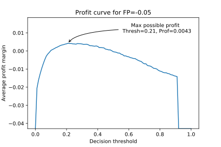
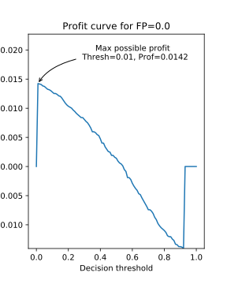
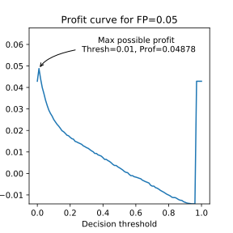
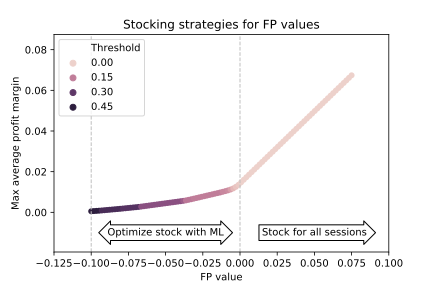
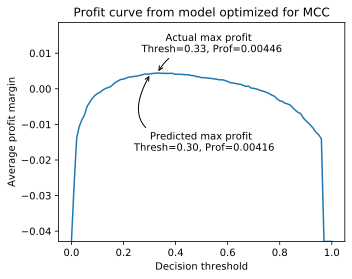
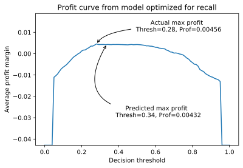
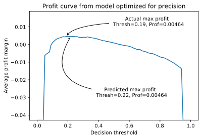
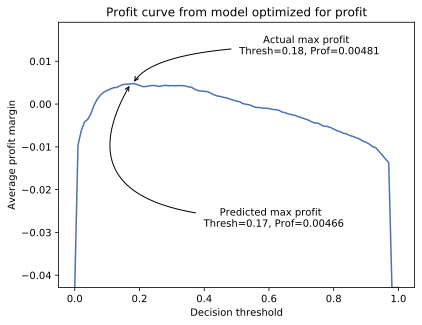
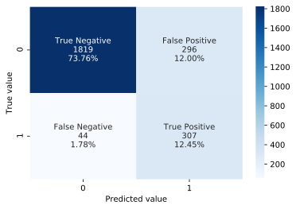
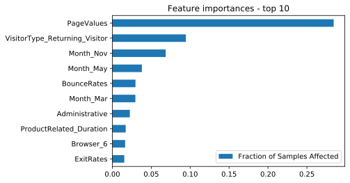

# Optimizing business decisions from online purchasing behavior

### Introduction

Analytics data such as web pages visited, types of web page visited (e.g. related products) exit rates, and bounce rates of users for e-commerce websites provides a picture of the factors surrounding purchase decisions and the chance to inform business decisions such as inventory stocking in order to maximize profits. The <a href="https://archive.ics.uci.edu/ml/datasets/Online+Shoppers+Purchasing+Intention+Dataset">browsing session data of 12,330 sessions for an E-commerce website based in Turkey</a> hosted in a public dataset at the <a href="https://archive.ics.uci.edu/ml/index.php">UCI Machine Learning Repository</a> allows the opportunity to explore online purchasing behavior in terms of these factors. What drives online purchasing behavior and how can that be used to inform business decisions, such as optimal inventory stocking? 

This project has the following goals:

1. Find a model that leads to the most profitable predictions
2. Determine feature importance, i.e. what drives the purchasing behavior?

### The Data

Data source citation: Sakar, C.O., Polat, S.O., Katircioglu, M. et al. Neural Comput & Applic (2018)

Description:

- 12,330 rows (browsing sessions) 
  - 18 features (10 numerical; 8 categorical)
  - Related to web page type (Informational, Product related, etc) and time duration on that page type
  - Related to time (Month, weekend, closeness to holidays, etc.)
  - Analytics (Exit rates, bounce rates, pages visited)
  - Categorical features like browser type, operating system, region, etc.
- Target variable: ‘Revenue’, whether a purchase was made (0 or 1)
  - Class ratio is 84:16 (majority is no purchase)
  
### Modelling: initial considerations

How much money is earned per sale, and what are the costs associated with false positive and false negative predictions? Consider:

**True positive**: Browsing session correctly predicted to result in sale. Money spent to acquire product; profit gained from sale without additional cost. 
**False positive**: Browsing session incorrectly predicted to result in sale. Money spent to acquire product; but because the sale is not immediately made, the product must be stored, incurring carrying cost prior to a possible sale later 
**True negative**: Browsing session correctly predicted not to result in sale. No money spent to acquire product; no profit. 
**False negative**: Browsing session incorrectly predicted not to result in sale. Profit is lost, because we don't have the product to make the sale when the customer would've made a purchase.  

What about the false positive? If a sale is incorrectly predicted to be made, now we have inventory that must be stored, incurring cost to carry the inventory prior to an eventual sale or (worse) a disposal of the product. Let's assume the product eventually sells. How long is it stored before the sale? If stored long enough, the "profit" could turn out to be a net loss!

Using a 10% profit margin, a confusion matrix could be assembled in terms of revenue R and carrying cost C per sale:

| |Actual positive | Actual negative|  
| --- | --- | --- | 
|Predicted positive |0.1R | 0.1R - C| 
| Predicted negative|-0.1R |0 | 

For simplicity, we could just use R = $1 (that is, every sale earns a buck of revenue). There are other possible costs associated with some of the confusion matrix values, such as a customer going to other businesses for future purchases if they couldn't buy a product they intended to buy from us. However, for simplicity's sake, we'll stick with the above values for this example. Also, to reiterate, we're assuming that products bought that were not sold immediately will sell eventually; there's just a question of how long and how much the carrying cost will dig into the profit. 

To explore possible profits as well as establish a baseline model, we'll split the data into a 80:20 train/test split, train a Random Forest Classifier on the data, and compute profit curves at the range of decision thresholds for different false positive values and see what the maximum possible profits are. We'll use -0.05 (where C renders a negative profit), 0 (break-even), and 0.05 (small enough C to leave a positive profit):

<table>
  <tr>
    <td></td><td></td><td></td>
  </tr>
  </table>
  

From here we could just see what the maximum profits and associated decision thresholds are from the whole range of -0.1 to 0.1:

  

   
  

The "average profit margin per session" is the total profit divided by the number of browsing sessions.

It turns out that from about FP=0 onwards, max profit occurs at the threshold of nearly zero, meaning that the best strategy in terms of maximizing profit is to invest in having a product on hand for every browsing session regardless of whether a purchase is made. At about FP = -0.1, the max profit (grimly) becomes zero. The range -0.1 to 0 is where the number of products to invest in is some fraction of the number of browsing sessions, and this is where a machine learning model could be tuned to predict the right amount of product to stock. 

### Modelling the FP = -0.05 case

We could choose FP = -0.05 as a basis of modelling because it falls in the middle of the range above between where the Random Forest Classifier predicts that no profit is possible and where the max profit is associated with a sale for all sessions (FP = -0.1 to 0), but in principle any value could be chosen, e.g. based on historical averages. 

We'll use the same 80:20 split from before and use the training fold to find a model that might lead to more profitable predictions than the baseline above. We'd like to try and get a better average profit per session than XXX on the test set. Because false negatives are more expensive than false positives in the scenario we're working under, we might consider looking for a model that maximizes recall. I evaluated models from these possible parameters:

| Parameter | Value | 
| --- | --- |
| max depth | 2, 5, 7, 9  |
| min samples split | 1, 2, 3, 4 |
| n estimators | 25, 50, 100, 200, 500 |
| learning rate | 0.05, 0.1, 0.2, 0.3, 0.4 |
| SMOTE oversampling | True, False |
| No. of features | 10-18 | 

The features were a randomly chosen set based on the number used for number of features, and I used 3x5-fold cross-validation (that is, scores are the average from 15 random 80:20 train/validation splits). 

I evaluated models with random combinations of the above parameters and scored them on MCC, precision, and recall and came up with the following results:

It's interesting how the results show two pretty distinct clusters for each metric. There may be something specific that has a marked effect on model performance, to be investigated in a below section.

Besides the conventional classification metrics, why not also just find the maximum profit of each model? I computed the maximum possible profit from each model and stored the corresponding decision threshold. The distribution of profits is shown here, again with the two distinct clusters of models:

Next, the models scoring highest on each metric was trained on the whole train split, applied to the test split, and the possible profits explored:

<table>
  <tr>
    <td></td><td></td>
  </tr>
    <tr>
    <td></td><td></td>
  </tr>
  </table>
  

The "max actual profit" is what it sounds like, and the "max predicted profit" is the profit using the threshold that computed the maximum profit at the training stage. It turns out that the model optimized for XXX leads to the highest profit. This is a XX increase over the baseline Random Forest Classifier model above. 

The predictions are split as follows:

  

   
  

The number of positive (true and false) values correspond to the number of items stocked ahead of time. Here, stock was purchased for xx of the sessions, or %xx of the sessions. 

The average profit value could be used to predict an actual profit using different values of R (revenue) per item as well as the number of predicted positives. The size of the test set contained XX sessions, which for R = $1 would grant a total profit of $XX, but this value could be scaled to correspond to a larger number of browsing sessions, to get an idea what the profit would be in those situations.

### What drives sales?

Or at least is associated with them?

A feature importances plot from the profit-optimized model from the previous section gives:

  

   
  

  
Right away, it's clear that 'PageValues' is important, i.e. the number of web pages visited before making a purchase.

This can be corroborated with SHAP, which is an 'industry standard' for finding feature contributions to model predictions. The following is a summary plot showing the feature importances and corresponding feature value:

  

   
  

  
 Again, 'PageValues' is at the top, as well as some features that appeared in the previous feature importances plot, like the November and May months. and...

